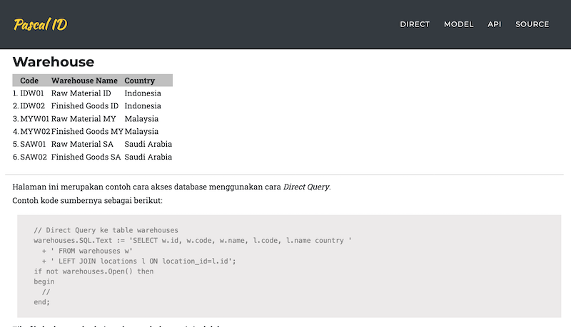

# Database dengan FastPlaz

Aplikasi ini menunjukkan contoh akses ke database dengan menggunakan [FastPlaz](https://fastplaz.com), salah satu [Web Framework untuk bahasa Pascal](https://fastplaz.com). 

Menggunakan 3 metode, yaitu dengan 

- Direct Query, 
- ORM Model, 
- API

Aplikasi ini dibuat dengan sederhana untuk percontohan, tanpa menggunakan autentikasi/verifikasi.

Sumber database menggunakan [Project Inventory](https://github.com/hidayat365/yii2-inventory-app/tree/master/migrations/scripts) dari om [Nur Hidayat](https://github.com/hidayat365).

## Metode Akses


### Direct Query



Cara ini sepertinya cara yang sudah paling umum digunakan oleh para developer, dengan menggunakan query langsung untuk mengakses database.

Contoh kode sumbernya sebagai berikut:

```pascal
    // Direct Query ke table warehouses
    warehouses.SQL.Text := 'SELECT w.id, w.code, w.name, l.code, l.name country '
      + ' FROM warehouses w'
      + ' LEFT JOIN locations l ON location_id=l.id';
    if not warehouses.Open() then
    begin
      //
    end;
```

### ORM Model


Ini merupakan contoh cara akses database menggunakan cara ORM (Object Relation Mapping). Langkah-langkahnya akan semakin lebih mudah karena hanya perlu mendefinisikan field apa yang akan ditampilkan serta tabel relasinya. Hasilnya akan sama dengan cara *direct access* di atas, namun lebih simple cara penulisan kodenya.

Contoh kode sumbernya sebagai berikut:

```delphi
    warehouses.AddJoin('locations', 'id', 'warehouses.location_id', ['code','name country']);
    if not warehouses.Find(whereAsArray) then
    begin
      //
    end;
```

### API


Berikut ini merupakan contoh cara akses database menggunakan cara pemanggilan ***API***. Cara menampilkannya dibantu dengan sedikit pemrograman Javascript, kali ini memanfaatkan pustaka jQuery.

Terlebih dahulu mesti dipersiapkan project API-nya, isinya mirip dengan contoh akses database menggunakan ORM Model, hanya saja output dibuat dalam format json, yang isinya kurang lebih seperti berikut:

```json
{
  "code": 0,
  "count": 3,
  "data": [
    {
      "id": 1,
      "code": "IDW01",
      "name": "Raw Material ID",
      "location_id": 1,
      "country_code": "ID",
      "country": "Indonesia"
    },
    {
      "id": 3,
      "code": "MYW01",
      "name": "Raw Material MY",
      "location_id": 2,
      "country_code": "MY",
      "country": "Malaysia"
    },
    {
      "id": 5,
      "code": "SAW01",
      "name": "Raw Material SA",
      "location_id": 3,
      "country_code": "SA",
      "country": "Saudi Arabia"
    }
  ]
}

```

Kode sumber pascal-nya akan seperti berikut:

```pascal

  json['code'] := 404;
  warehouses.AddJoin('locations', 'id', 'warehouses.location_id', ['code country_code','name country']);
  if warehouses.Find(whereAsArray) then
  begin
    json['code'] := 0;
    json['count'] := warehouses.RecordCount;
    json.ValueArray['data'] := warehouses.AsJsonArray(False);
  end;
  Response.Content := json.AsJSON;
```

